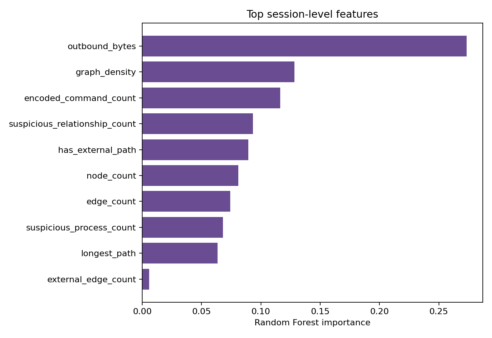
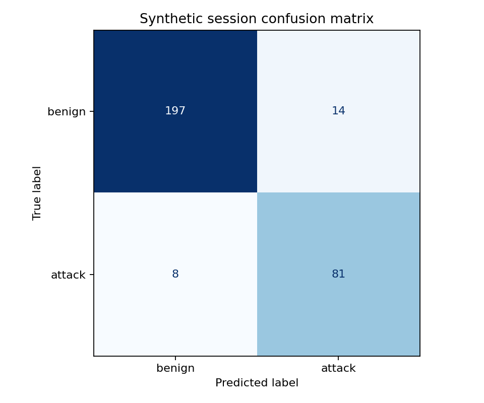

# Graph Threat Detection Demo

> Interpretable threat detection from synthetic endpoint event graphs.

## Problem

Individual log lines often look harmless even when their sequence forms a suspicious attack chain. This project represents each endpoint session as a directed event graph, extracts structural and behavioral features, and trains a classifier to distinguish benign from compromised sessions.

## What this project demonstrates

- Generation of reproducible, labeled endpoint-event chains
- Directed graph construction without a specialized graph library
- Structural features such as density, branching, path length, and out-degree
- Security features such as encoded commands, rare parent-child relationships, and external data movement
- Stratified validation with ROC-AUC, F1, recall, and a confusion matrix
- Feature-importance analysis for analyst-facing interpretation
- Tests for graph construction and path extraction

## Pipeline

```text
Synthetic event rows -> Session graphs -> Graph/behavioral features
                     -> Random Forest -> Metrics and explanations
```

## Quick start

```bash
python -m venv .venv
python -m pip install -r requirements.txt
python src/run_pipeline.py
python -m unittest discover -s tests -v
```

On Windows PowerShell, activate the environment with `.venv\Scripts\Activate.ps1`.

## Outputs

- `data/event_edges.csv`
- `results/session_features.csv`
- `results/metrics.json`
- `results/feature_importance.csv`
- `results/confusion_matrix.png`
- `results/roc_curve.png`
- `results/feature_importance.png`

## Results

On 300 held-out synthetic sessions, the detector achieved:

| Metric | Score |
|---|---:|
| ROC-AUC | 0.923 |
| Accuracy | 0.927 |
| Precision | 0.853 |
| Recall | 0.910 |
| F1 | 0.880 |
| Five-fold CV ROC-AUC | 0.892 |

The generator includes stealthy attacks and benign administrator activity that resembles suspicious behavior, preventing a trivially perfect benchmark.





## Interpretation

The model uses graph structure and event metadata rather than raw command text. Important features typically include suspicious process relationships, encoded-command events, external edges, and whether a multi-hop path reaches an untrusted destination. These features give an analyst evidence to investigate instead of only a binary prediction.

## Limitations

The dataset is intentionally synthetic and the attack patterns are simplified. High scores on these generated sessions do not establish production effectiveness. A real evaluation would require time-aware splits, multiple environments, adversarial drift tests, calibrated thresholds, and review of false positives with analysts.

## Research connection

This independent demonstration is inspired by the graph-analytics problems studied in Elnaz Rabieinejad's threat-modeling research. It is not the ThreatTracer implementation and does not reproduce the paper's experiments or results.
